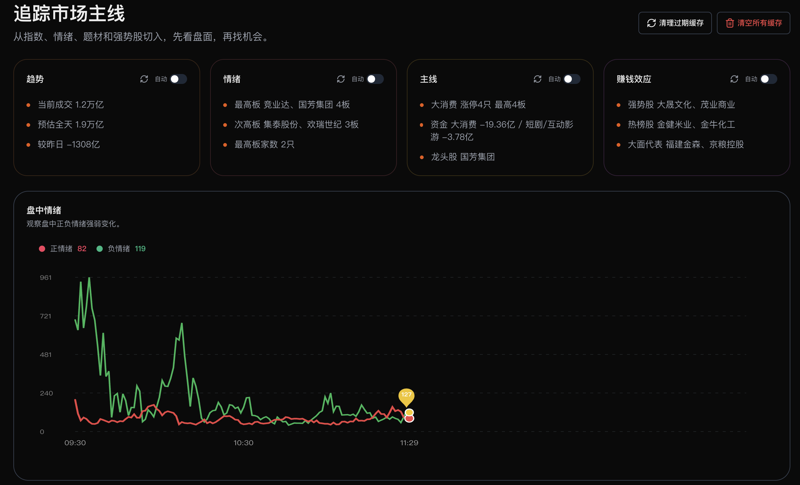
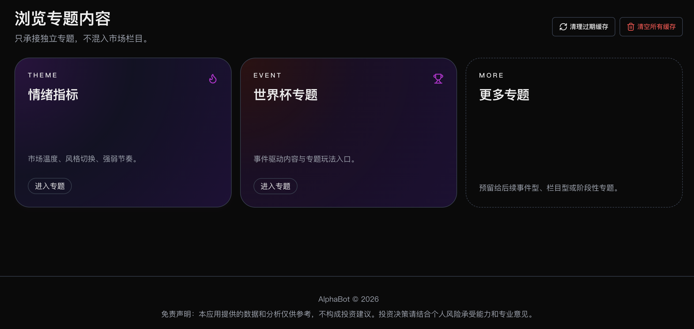

# AlphaBot Frontend

基于 `Next.js 15 + React 19` 的 AlphaBot 前端。

## 页面入口

- 个股主页：`/`
- 市场主页：`/?view=market`
- 专题主页：`/?view=topic`
- 智能助手：`/agent`

## 本地启动

```bash
cd frontend
npm install
npm run dev
```

访问 `http://localhost:3000`。

## 截图占位



